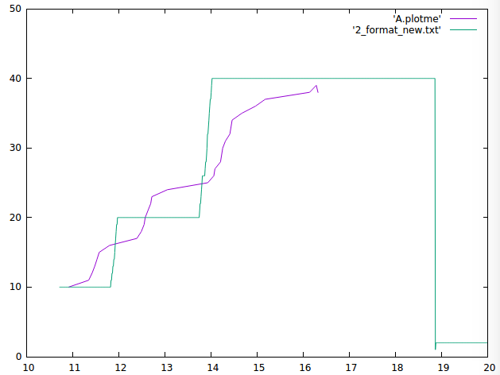
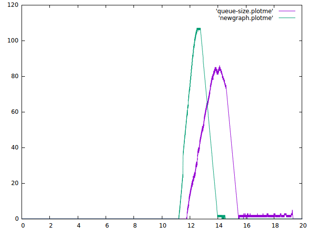
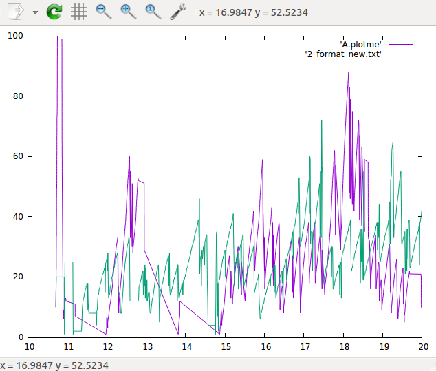
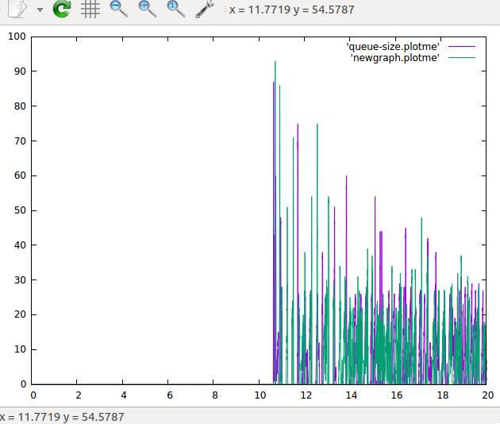

# TCP HighSpeed DCE

Comparison of **ns-3** and **Linux kernel** implemetations of **TCP HighSpeed Protocol** using **Direct Code Execution** (DCE)

Please Visit out [Wiki page](https://github.com/omkarprabhu-98/tcp-highspeed-dce/wiki) for more information 

## Final Result

#### Data rate: Between Routers: 1Mbps, Between Router - Node: 10Mbps

- Congestion Window

    

A.plotme - ns-3, 2_format_new.txt - Linux

- Queue Size

    

queue-size.plotme - ns-3, newgraph.plotme - Linux
    
#### Data rate: Between Routers: 150Mbps, Between Router - Node: 150Mbps

- Congestion Window

    

A.plotme - ns-3, 2_format_new.txt - Linux

- Queue Size

    

queue-size.plotme - ns-3, newgraph.plotme - Linux

We have identified possible resons for the deviation in the results. This can be found [here](https://github.com/omkarprabhu-98/tcp-highspeed-dce/wiki/Comparison-of-ns-3-and-Linux-kernel-implementation-of-TCP-HighSpeed)

## Network Topology
Dumbbell Topology - With 2 Routers and 5 nodes on each side of the router

(5 nodes) -- (1 router) -- (1 router) -- (5 nodes)

With each node having a point to point connection to the router

## Configurations
#### Inside the `main` function
- `stack` - ("linux"/"ns3")
- `transport_prot` - TcpHighSpeed
- `linux_prot` - highspeed
- `queue_disc_type` - RedQueueDisc

#### Adjustments made
- FACK, SACK, DSACK, ECN have been disabled in both implementations
- PRR is enabled

## Files
- `dce-gfc-dumbbell-new.cc` - Merged code for running tcp high speed implementations of ns-3 and linux kernel
- `plot-scripts/plot_cwnd_comparison.sh` - Script to plot congestion window data from ns-3 and linux stacks 
- `plot-scripts/plot_queue_size_comparison.sh` - Script to plot queue size data from ns-3 and linux stacks  
- `plot-scripts/gnuplot_cwnd` - gnuplot commands to plot congestion window data
- `plot-scripts/gnuplot_queue_size` - gnuplot commands to plot queue size data

## References
- [TCP HighSpeed RFC](https://tools.ietf.org/pdf/rfc3649.pdf)
- [Linux Implementation](https://github.com/torvalds/linux/blob/master/net/ipv4/tcp_highspeed.c)
- [ns-3 Implementation](https://www.nsnam.org/doxygen/tcp-highspeed_8cc_source.html)
